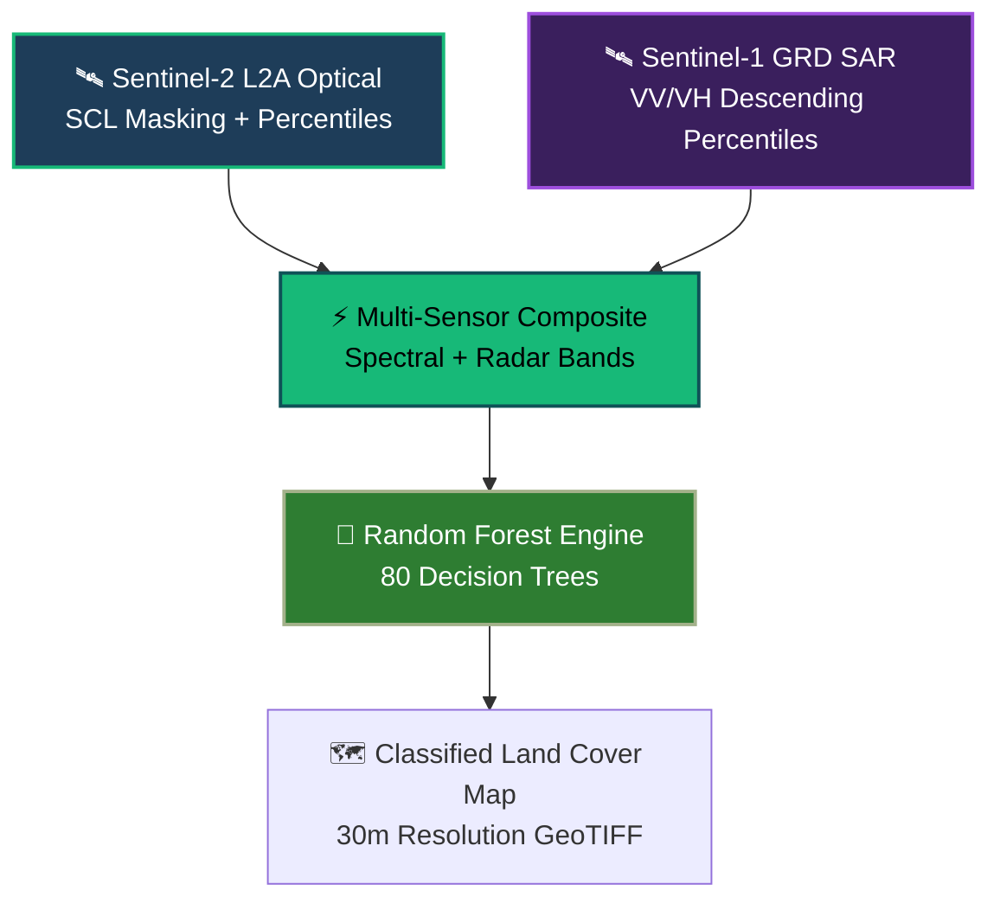
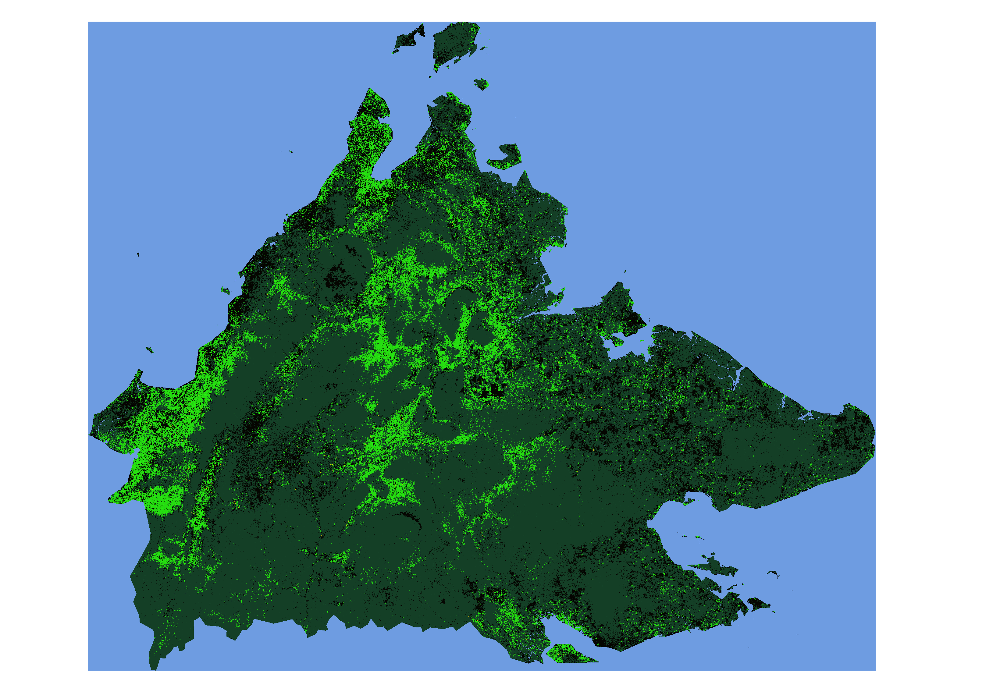

[static_map.tiff](https://github.com/user-attachments/files/31096898/static_map.tiff)[static_map.tiff](https://github.com/user-attachments/files/31096880/static_map.tiff)

# 🌴 Multi-Sensor Land Cover Classification | Sabah, Malaysia


> [!NOTE]
> **Challenge & Solution:** Persistent tropical cloud cover across East Malaysia frequently degrades standard satellite optical composites. This workflow integrates **Sentinel-2 optical percentiles ($P_{90}, P_{70}, P_{55}$)** with **Sentinel-1 C-Band SAR backscatter ($P_{75}, P_{55}$)** to build a cloud-resilient feature stack for large-scale land cover mapping.

---

## 🎨 Workflow Architecture



## 🗺️ Interactive Web Map

Click the link or map preview below to explore the full-resolution interactive dataset with pan and zoom capabilities:

👉 **[Launch Interactive Sabah Land Cover Map](https://braynchung.github.io/Multi-Sensor-Sabah-Land-Cover-Classification/)**

<!-- If the image is inside the docs folder: -->
[](https://braynchung.github.io/Multi-Sensor-Sabah-Land-Cover-Classification/)
---


## 📊 Classification Palette

| Class ID | Class Name | Swatch | Color Code | Cartographic Description |
| :---: | :--- | :---: | :---: | :--- |
| **`0`** | **Water Bodies** |  | `#6e9ce1` | **Soft Blue:** Coastal, marine, and inland water bodies |
| **`1`** | **Cropland** |  | `#25dc10` | **Bright Green:** Plantations, agricultural land, and crop fields |
| **`2`** | **Forest** |  | `#143f26` | **Dark Canopy Green:** Dense tropical forest canopy |
| **`3`** | **Urban / Built-up** |  | `#050601` | **Dark Charcoal:** Roads, urban infrastructure, and exposed rock |
| **`4`** | **Rangeland / Grass** |  | `#e3c304` | **Gold / Yellow:** Open grasslands, scrublands, and clearings |
---

## 🚀 Key Features

* 🌤️ **Pixel-Level Cloud Filtering:** Utilizes Sentinel-2's Scene Classification Layer (`SCL`) to remove shadows, high/medium cloud probabilities, and thin cirrus.
* 📈 **Percentile Compositing:** Employs $P_{90}$ for peak canopy vegetation greenness while filtering transient cloud artifacts across a 2-year temporal window (2023–2024).
* 📡 **SAR Penetration:** Blends Sentinel-1 VV and VH backscatter percentiles to differentiate structural features, wet soil, and canopy density independent of weather.
* 🎨 **Direct RGB Visual Export:** Uses GEE's `.visualize()` method to export pre-colored 3-band GeoTIFF rasters directly readable in QGIS.

---


## 💻 Earth Engine Code (`sabah_landcover_mapping.js`)

```javascript
/**
 * Title: Multi-Sensor Land Cover Classification (Sabah, Malaysia)
 * Data: Sentinel-2 L2A (Optical) + Sentinel-1 GRD (SAR)
 * Engine: Google Earth Engine (GEE)
 */

// =========================================================================
// 1. REGION OF INTEREST (ROI)
// =========================================================================
var roi = table.filterBounds(geometry).map(function(feature){
  return feature.simplify(2000);
});

Map.centerObject(roi, 8);
Map.addLayer(roi, {color: 'FF0000'}, 'ROI Boundary', false);

// =========================================================================
// 2. SENTINEL-2 OPTICAL PROCESSING (SCL CLOUD MASKING + INDICES)
// =========================================================================
var sen2 = imageCollection
  .filterDate('2023-01-01', '2025-01-01')
  .filterBounds(roi)
  .filter(ee.Filter.lt('CLOUDY_PIXEL_OVER_LAND_PERCENTAGE', 40))
  .map(function(img){
    // Mask out: 3=Cloud Shadows, 8=Medium Cloud, 9=High Cloud, 10=Cirrus
    var scl = img.select('SCL');
    var mask = scl.neq(3).and(scl.neq(8)).and(scl.neq(9)).and(scl.neq(10));
    
    var bands = img.select('B[2-8]').multiply(0.0001);
    var ndvi = bands.normalizedDifference(['B8', 'B4']).rename('ndvi');
    var ndwi = bands.normalizedDifference(['B3', 'B8']).rename('ndwi');
    
    return bands.addBands(ndvi).addBands(ndwi)
      .updateMask(mask)
      .copyProperties(img, ['system:time_start', 'system:time_end']);
  });

// Temporal Percentile Reduction
var sen2_per = sen2.reduce(ee.Reducer.percentile([90, 70, 55]));

// Display NDVI P90
Map.addLayer(sen2_per.select('ndvi_p90').clip(roi), 
  {min: 0.0, max: 0.9, palette: ['000000', 'FFFFFF']}, 
  'NDVI P90 (Grayscale)', false);

// =========================================================================
// 3. SENTINEL-1 SAR PROCESSING (C-BAND BACKSCATTER)
// =========================================================================
var sen1 = imageCollection2
  .filterDate('2023-01-01', '2025-01-01')
  .filterBounds(roi)
  .filter(ee.Filter.listContains('transmitterReceiverPolarisation', 'VV'))
  .filter(ee.Filter.eq('instrumentMode', 'IW'))
  .select('VV', 'VH')
  .filter(ee.Filter.eq('orbitProperties_pass', 'DESCENDING'));

var sen1_per = sen1.reduce(ee.Reducer.percentile([75, 55]));

// =========================================================================
// 4. MULTI-SENSOR FUSION & RANDOM FOREST CLASSIFICATION
// =========================================================================
var dataset = sen2_per.addBands(sen1_per);

var samples = water.merge(cropland).merge(forest).merge(urban).merge(rangeland);

var training_data = dataset.sampleRegions({
  collection: samples,
  properties: ['class'],
  scale: 30
});

var model = ee.Classifier.smileRandomForest(80).train({
  features: training_data,
  classProperty: 'class',
  inputProperties: dataset.bandNames()
});

// Run Classification
var map = dataset.classify(model).rename('classified_map');

// Define Visual Palette
var visParams = {
  min: 0, 
  max: 4, 
  palette: ['0000FF', '00FF00', '006400', '000000', 'FFA500']
};

Map.addLayer(map.clip(roi), visParams, 'Sabah Land Cover Classification 2023-2024');

// =========================================================================
// 5. DIRECT RGB COLOR EXPORT FOR QGIS / DRIVE
// =========================================================================
// Converts raw integer raster into a 3-band RGB image for visual export
var mapRGB = map.visualize(visParams);

Export.image.toDrive({
  image: mapRGB.clip(roi),
  description: 'Sabah_LandCover_2023_2024_RGB',
  region: roi,
  scale: 30,
  folder: 'GEE_Exports',
  crs: 'EPSG:4326',
  maxPixels: 1e13
});

```

---

> [!TIP]
> **QGIS Workflow Hint:**
> * If exporting raw single-band integer maps (`map.clip(roi)`), set the QGIS Symbology to **Paletted/Unique Values** and assign class IDs `0-4` to their respective colors.
> * If using `mapRGB` (produced via `.visualize()`), open directly in QGIS as a standard **Multiband Color** GeoTIFF.
> 
> 

```

```
